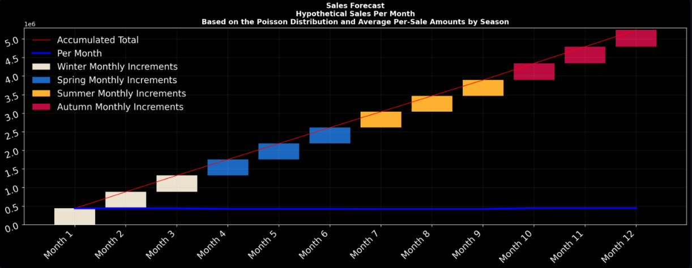
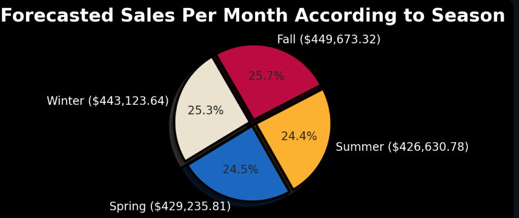

# Review Analysis Notebook

**Notebook:** `Analyze_Reviews.ipynb`

> ## Identify Variables That Have the Greatest Influence on Review Ratings
>
> Consumer reviews and ratings can directly influence sales through mechanisms such as product placement, recommendation systems, and search ranking. Understanding which variables have the greatest impact on review ratings can help organizations improve customer experiences and optimize product performance.
>
> As AI-driven automation continues to expand, pipelines that monitor and analyze review ratings are likely to become increasingly important. For example, a January 2026 Forbes article discusses how the future of ChatGPT advertising may depend heavily on relevance and credibility. Consumer reviews have the potential to serve as measurable indicators of both.
>
> This notebook explores consumer review data to identify the variables most strongly associated with review ratings through exploratory analysis, statistical methods, and machine learning techniques.

### References

DeBoe, T. (2026, January 27). *ChatGPT Ads Just Changed The Rules Of Marketing Forever*.
https://www.forbes.com/sites/terdawn-deboe/2026/01/26/chatgpt-ads-just-changed-the-rules-of-marketing-forever/

Sipka, A. (2025, December 23). *Why Is Optimal Product Ranking Important for E-Commerce Businesses*.
https://www.luigisbox.com/blog/what-is-product-ranking/

### Topics Covered

* Exploratory Data Analysis (EDA)
* Feature Importance Analysis
* Correlation Analysis
* Review Rating Drivers
* Data Visualization
* Statistical Testing
* Consumer Behavior Analytics
* Machine Learning-Based Feature Evaluation

The goal is to determine which factors have the strongest influence on customer review ratings and to provide actionable insights that can be used to improve product visibility, ranking, and overall customer satisfaction.

---

# Sales Forecasting with the Poisson Distribution

This project explores how the **Poisson Distribution** can be used to forecast future sales from historical purchase frequencies. The accompanying Streamlit application allows users to interactively analyze purchasing behavior and estimate expected sales volumes based on observed event frequencies.

### Live Application

🚀 **Try the application:**
https://consumerhabits-ev6vuk6x352jzp8nmpkvbi.streamlit.app/

### Application Preview

  
  

The application demonstrates how probabilistic modeling can be applied to consumer purchasing patterns to estimate future demand, support inventory planning, and identify seasonal sales behavior.

